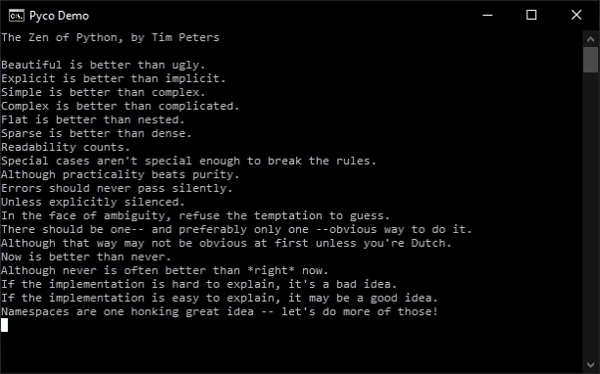
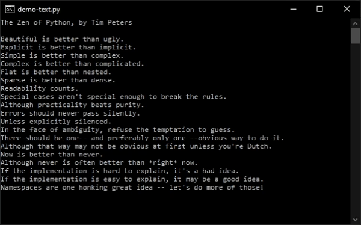
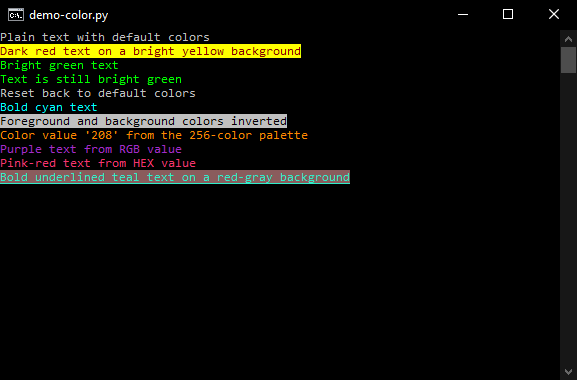
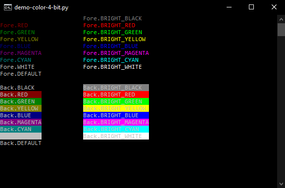
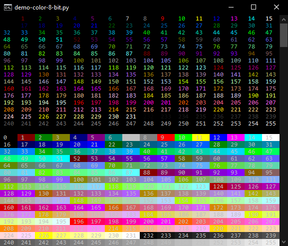

# ANSI Escape Codes
The `pyco.ansi` class contains ANSI escape codes you can use independently of the [`print_message()`] and [`user_input()`] functions.

## Overview
- [Terminal](#terminal)
- [Cursor](#cursor)
- [Text](#text)
- [InputKeys](#inputkeys)
- [Color](#color)

## Terminal
Functions for interacting with the terminal window.

### `ClearScreen(mode: int)`
Clear text in the terminal window.
Note: Modes `2` and `3` may not work as expected on Windows.

Parameter|Default Value|Type|Description
------|---|-----|-------------------------------------------
`mode`|`2`|`int`|Which text to clear, relative to the cursor

#### Options
Value|Description
---|------------------------------------------------------------------
`0`|Clear all text from the cursor to the end of the screen
`1`|Clear all text from the cursor to the beginning of the screen
`2`|Clear all text
`3`|Clear all text and delete all lines saved in the scrollback buffer

### `ClearLine(mode: int)`
Clear text on the current line. Cursor position does not change.

Parameter|Default Value|Type|Description
------|---|-----|---------------------------------------------------------------
`mode`|`2`|`int`|Which text on the current line to clear, relative to the cursor

#### Options
Value|Description
---|-----------------------------------------------------------
`0`|Clear all text from the cursor to the end of the line
`1`|Clear all text from the cursor to the beginning of the line
`2`|Clear the entire line

### `ScrollUp(n: int)`
Move the text up `n` number of lines.

Parameter|Default Value|Type|Description
---|---|-----|---------------------------------------------
`n`|`1`|`int`|Number of lines to move the text on screen up

### `ScrollDown(n: int)`
Move the text down `n` number of lines.

Parameter|Default Value|Type|Description
---|---|-----|-----------------------------------------------
`n`|`1`|`int`|Number of lines to move the text on screen down

### `SetWindowTitle(title: str)`
Set the terminal window title.

Parameter|Type|Description
-------|-----|----------------
`title`|`str`|The window title

### `Width80()`
Set the terminal width to `80` columns.

### `Width132()`
Set the terminal window width to `132` columns.

### `Bell()`
Play a sound.

### `MainScreenBuffer()`
Switch to the main screen buffer.

### `AltScreenBuffer()`
Switch to a new alternate screen buffer. This allows you to save the current terminal state, switch to a blank screen, then go back to the main screen using `MainScreenBuffer()`.

### `ResetAll()`
Reset all terminal settings to their default values.

### Example
<details>
<summary>Click to expand</summary>

```python
from pyco import *
import this
from time import sleep

Terminal.SetWindowTitle("Pyco Demo")
sleep(0.5)
Terminal.Bell()
sleep(0.5)
Terminal.ScrollUp()
sleep(0.5)
Terminal.ScrollDown()
sleep(0.5)
Cursor.LineUp(5)
sleep(0.5)
Cursor.Right(5)
sleep(0.5)
Terminal.ClearLine(0)
sleep(0.5)
Cursor.Up()
sleep(0.5)
Terminal.ClearLine(1)
sleep(0.5)
Cursor.Up()
sleep(0.5)
Terminal.ClearLine(2)
sleep(0.5)
Terminal.AltScreenBuffer()
sleep(0.5)
print("Text in the alternate screen buffer")
sleep(0.5)
Terminal.MainScreenBuffer()
sleep(0.5)
print("Text in the main screen buffer")
sleep(0.5)
Terminal.ClearScreen()
```

</details>

## Cursor
Functions for modifying cursor parameters and position.

### `Up(n: int)`
Move the cursor up `n` number of characters.

Parameter|Default Value|Type|Description
---|---|-----|-------------------------------
`n`|`1`|`int`|Number of characters to move up

### `Down(n: int)`
Move the cursor down `n` number of characters.

Parameter|Default Value|Type|Description
---|---|-----|---------------------------------
`n`|`1`|`int`|Number of characters to move down

### `Right(n: int)`
Move the cursor right `n` number of characters.

Parameter|Default Value|Type|Description
---|---|-----|----------------------------------
`n`|`1`|`int`|Number of characters to move right

### `Left(n: int)`
Move the cursor left `n` number of characters.

Parameter|Default Value|Type|Description
---|---|-----|---------------------------------
`n`|`1`|`int`|Number of characters to move left

### `LineUp(n: int)`
Move the cursor up `n` number of lines.

Parameter|Default Value|Type|Description
---|---|-----|--------------------------
`n`|`1`|`int`|Number of lines to move up

### `LineDown(n: int)`
Move the cursor down `n` number of lines.

Parameter|Default Value|Type|Description
---|---|-----|----------------------------
`n`|`1`|`int`|Number of lines to move down

### `Horizontal(x: int)`
Move the cursor to column `x`.

Parameter|Default Value|Type|Description
---|---|-----|-------------------
`x`|`0`|`int`|Absolute X position

### `Vertical(y: int)`
Move the cursor to row `y`.

Parameter|Default Value|Type|Description
---|---|-----|-------------------
`y`|`0`|`int`|Absolute Y position

### `SetPosition(x: int, y: int)`
Move the cursor to column `x` and line `y`.

Parameter|Default Value|Type|Description
---|---|-----|-------------------
`x`|`0`|`int`|Absolute X position
`y`|`0`|`int`|Absolute Y position

### `GetPosition()`
Gets the current cursor position by switching to an alternate buffer and reading the position output. Returns an integer tuple `(x, y)`.

### `SavePosition()`
Save the current cursor position in memory to restore later.

### `RestorePosition()`
Restore the cursor position to the last saved position. Defaults to position `0, 0` if no position was saved.

### `Show()`
Make the terminal cursor visible.

### `Hide()`
Make the terminal cursor invisible.

### `EnableBlink()`
Make the terminal cursor start blinking.

### `DisableBlink()`
Make the terminal cursor stop blinking.

### Example
<details>
<summary>Click to expand</summary>

```python
from pyco import *
import this
from time import sleep

print(Fore.BRIGHT_GREEN, end='', flush=True)
sleep(2)
Cursor.LineUp(5)
sleep(0.5)
print("Up 5 lines", end='', flush=True)
sleep(0.5)
Cursor.Right(5)
sleep(0.5)
print("Right 5 characters", end='', flush=True)
sleep(0.5)
Cursor.Up(1)
sleep(0.5)
print("Up 1 character", end='', flush=True)
sleep(0.5)
Cursor.Down(2)
sleep(0.5)
print("Down 2 characters", end='', flush=True)
sleep(0.5)
Cursor.Left(50)
sleep(0.5)
print("Left 50 characters", end='', flush=True)
sleep(0.5)
Cursor.LineUp(9)
sleep(0.5)
print("Up 9 lines ", end='', flush=True)
sleep(0.5)
Cursor.SavePosition()
sleep(0.5)
print("Saved position", end='', flush=True)
sleep(0.5)
Cursor.LineDown(2)
sleep(0.5)
print("Down 2 lines", end='', flush=True)
sleep(0.5)
Cursor.Horizontal(28)
sleep(0.5)
print("X position 28", end='', flush=True)
sleep(0.5)
Cursor.Vertical(8)
sleep(0.5)
print("Y position 8", end='', flush=True)
sleep(0.5)
Cursor.SetPosition(11, 2)
sleep(0.5)
print("X position 11, Y position 2", flush=True)
sleep(0.5)
Cursor.Hide()
sleep(0.5)
print("Cursor hidden", flush=True)
sleep(2)
Cursor.Show()
sleep(0.5)
print("Cursor visible", flush=True)
sleep(2)
Cursor.DisableBlink()
sleep(0.5)
print("Cursor blink disabled", flush=True)
sleep(2)
Cursor.EnableBlink()
sleep(0.5)
print("Cursor blink enabled", flush=True)
sleep(2)
print("Cursor position is: " + str(Cursor.GetPosition()), flush=True)
sleep(0.5)
Cursor.RestorePosition()
sleep(0.5)
print("Cursor position restored to previous saved position", flush=True)
```

</details>

## Text
Functions for modifying terminal text using escape codes.

### `InsertChar(n: int)`
Insert `n` spaces starting at the current cursor position.

Parameter|Default Value|Type|Description
---|---|-----|--------------------------
`n`|`1`|`int`|Number of spaces to insert

### `DeleteChar(n: int)`
Delete `n` characters starting at the current cursor position.

Parameter|Default Value|Type|Description
---|---|-----|------------------------------
`n`|`1`|`int`|Number of characters to delete

### `EraseChar(n: int)`
Erase `n` characters starting at the current cursor position by overwriting them with a space character.

Parameter|Default Value|Type|Description
---|---|-----|---------------------------------
`n`|`1`|`int`|Number of characters to overwrite

### `InsertLine(n: int)`
Insert `n` lines starting at the current cursor position.

Parameter|Default Value|Type|Description
---|---|-----|--------------------------
`n`|`1`|`int`|Number of lines to insert

### `DeleteLine(n: int)`
Delete `n` lines starting from the cursor row.

Parameter|Default Value|Type|Description
---|---|-----|-------------------------
`n`|`1`|`int`|Number of lines to delete

### `CharSetASCII()`
Switch to the default ASCII character mode.

### `CharSetLineDrawing()`
Switch to the DEC line drawing character mode.
When this mode is enabled, ASCII characters are mapped as follows:

<details>
<summary>Click to expand</summary>

ASCII|Line Drawing
---|---
`j`|`┘`
`k`|`┐`
`l`|`┌`
`m`|`└`
`n`|`┼`
`q`|`─`
`t`|`├`
`u`|`┤`
`v`|`┴`
`w`|`┬`
`x`|`│`
`a`|`▒`
`f`|`°`
`g`|`±`
`y`|`≤`
`z`|`≥`
`{`|`π`
`}`|`£`
`\|`|`≠`
`` ` ``|``♦``
`~`|`·`
</details>

Uppercase letters are unaffected. For a detailed description see <https://docs.microsoft.com/en-us/windows/console/console-virtual-terminal-sequences#designate-character-set>.

### Example
<details>
<summary>Click to expand</summary>

```python
from pyco import *
import this
from time import sleep

Cursor.LineUp(3)
sleep(0.5)
Text.InsertChar(5)
sleep(0.5)
Cursor.LineUp()
sleep(0.5)
Text.DeleteChar(5)
sleep(0.5)
Cursor.LineUp()
sleep(0.5)
Text.EraseChar(5)
sleep(0.5)
Cursor.LineUp()
sleep(0.5)
Text.InsertLine()
sleep(0.5)
Cursor.LineUp(3)
sleep(0.5)
Text.DeleteLine()
print(Fore.BRIGHT_GREEN)
sleep(1)
Text.CharSetLineDrawing()
print("This text is printed with the Line Drawing character set")
sleep(1)
print("j k l m n q t u v w x a f g y z { } | ` ~ ")
sleep(1)
Text.CharSetASCII()
print("This text is printed with the default ASCII character set")
```

</details>

## InputKeys
Functions in this class can be used to emulate certain keypresses in the terminal window.

## Color
Color escape code constants and functions. You can combine constants when using them in [`print_message()`] or [`user_input()`], or in other output functions.

### 4-Bit Colors
The original ANSI escape codes for 16 colors (8 normal and 8 bright) can be found as constants under both `Color.Foreground` and `Color.Background` classes. The precise RGB values for each of the constants will vary depending on the terminal.

#### Constants
Constant|Description
----------------|--------------------------
`BLACK`         |Black
`RED`           |Red
`GREEN`         |Green
`YELLOW`        |Yellow
`BLUE`          |Blue
`MAGENTA`       |Magenta
`CYAN`          |Cyan
`WHITE`         |Gray
`BRIGHT_BLACK`  |Bright black/dark gray
`BRIGHT_RED`    |Bright red
`BRIGHT_GREEN`  |Bright green
`BRIGHT_YELLOW` |Bright yellow
`BRIGHT_BLUE`   |Bright blue
`BRIGHT_MAGENTA`|Bright magenta
`BRIGHT_CYAN`   |Bright cyan
`BRIGHT_WHITE`  |Bright white
`DEFAULT`       |Default, usually `WHITE`

### 8-Bit Colors
Most terminals support a palette of 256 colors, accessible with the `EightBit()` function. For a detailed list of colors see <https://en.wikipedia.org/wiki/ANSI_escape_code#8-bit>.

`EightBit()` takes one parameter which is the number of the color from `0` to `255`.
### 24-Bit Colors
Some terminals support standard RGB values like `(53, 174, 89)`. The `TwentyFourBit()` function allows you to set the foreground or background color from an RGB or HEX value. `TwentyFourBit()` takes either a tuple RGB value or a HEX code string.

#### Alternate Names
- `RGB()`
- `rgb()`
- `HEX()`
- `hex()`

### Styles
Style modifiers to change the look of the text.

#### Constants
Constant|Description
------------------|-------------------------------------------------------------------
`RESET`           |Reset all color and style values to their default values
`BOLD`            |Bold text, interpreted as "bright color" on some terminals
`DIM`             |Dark text, not supported on some terminals
`ITALIC`          |Italicized text, not supported on some terminals
`UNDERLNE`        |Underlined text
`SLOW_BLINK`      |Slowly blinking text, not supported on some terminals
`FAST_BLINK`      |Fast blinking text, not supported on some terminals
`INVERT`          |Invert the foreground and background colors
`STRIKE`          |Striked out text, not supported on some terminals
`DOUBLE_UNDERLINE`|Doubly underlined text, interpreted as "not bold" on some terminals
`NORMAL`          |Reset all style values to their default values
`NO_UNDERLINE`    |Not underlined text
`NO_INVERT`       |Foreground and background colors not inverted

### Defaults
You can change the default colors used in [`print_message()`] and [`user_input()`] by assigning variables in the `Color` class to a constant of your choice.

Constant|Default Value|Description
-----------------------|--------------------------------|------------------------------------
`DEFAULT_MESSAGE_COLOR`|`Color.Foreground.WHITE`        |Default color for message text
`DEFAULT_PREFIX_COLOR` |`Color.Foreground.WHITE`        |Default color for normal prefix text
`DEFAULT_INPUT_COLOR`  |`Color.Foreground.WHITE`        |Default color for user input text
`ERROR`                |`Color.Foreground.BRIGHT_RED`   |Default color for error prefixes
`WARNING`              |`Color.Foreground.BRIGHT_YELLOW`|Default color for warning prefixes
`SUCCESS`              |`Color.Foreground.BRIGHT_GREEN` |Default color for success prefixes
`INFO`                 |`Color.Foreground.WHITE`        |Default color for info prefixes

### Examples
#### `demo-color.py`
<details>
<summary>Click to expand</summary>

```python
from pyco import *

print(Fore.DEFAULT + Back.DEFAULT + "Plain text with default colors" + Style.RESET)
print(Fore.RED + Back.BRIGHT_YELLOW + "Dark red text on a bright yellow background" + Style.RESET)
print(Fore.BRIGHT_GREEN + "Bright green text")
print("Text is still bright green" + Style.RESET)
print("Reset back to default colors")
print(Style.BOLD + Fore.CYAN + "Bold cyan text" + Style.RESET)
print(Style.INVERT + "Foreground and background colors inverted" + Style.RESET)
print(Fore.EightBit(208) + "Color value '208' from the 256-color palette" + Style.RESET)
print(Fore.TwentyFourBit((164, 43, 202)) + "Purple text from RGB value" + Style.RESET)
print(Fore.TwentyFourBit('#f7346e') + "Pink-red text from HEX value" + Style.RESET)
print(Style.BOLD + Style.UNDERLINE + Fore.TwentyFourBit((47, 237, 202)) + Back.TwentyFourBit((138, 92, 92)) + "Bold underlined teal text on a red-gray background" + Style.RESET)
```

</details>

#### `demo-color-4-bit.py`
<details>
<summary>Click to expand</summary>

```python
from pyco import *

print(Fore.BLACK   + "Fore.BLACK  " + "\t\t" + Fore.BRIGHT_BLACK   + "Fore.BRIGHT_BLACK  " + Style.RESET)
print(Fore.RED     + "Fore.RED    " + "\t\t" + Fore.BRIGHT_RED     + "Fore.BRIGHT_RED    " + Style.RESET)
print(Fore.GREEN   + "Fore.GREEN  " + "\t\t" + Fore.BRIGHT_GREEN   + "Fore.BRIGHT_GREEN  " + Style.RESET)
print(Fore.YELLOW  + "Fore.YELLOW " + "\t\t" + Fore.BRIGHT_YELLOW  + "Fore.BRIGHT_YELLOW " + Style.RESET)
print(Fore.BLUE    + "Fore.BLUE   " + "\t\t" + Fore.BRIGHT_BLUE    + "Fore.BRIGHT_BLUE   " + Style.RESET)
print(Fore.MAGENTA + "Fore.MAGENTA" + "\t\t" + Fore.BRIGHT_MAGENTA + "Fore.BRIGHT_MAGENTA" + Style.RESET)
print(Fore.CYAN    + "Fore.CYAN   " + "\t\t" + Fore.BRIGHT_CYAN    + "Fore.BRIGHT_CYAN   " + Style.RESET)
print(Fore.WHITE   + "Fore.WHITE  " + "\t\t" + Fore.BRIGHT_WHITE   + "Fore.BRIGHT_WHITE  " + Style.RESET)
print(Fore.DEFAULT + "Fore.DEFAULT" + Style.RESET)
print()
print(Back.BLACK   + "Back.BLACK  " + "\t\t" + Back.BRIGHT_BLACK   + "Back.BRIGHT_BLACK  " + Style.RESET)
print(Back.RED     + "Back.RED    " + "\t\t" + Back.BRIGHT_RED     + "Back.BRIGHT_RED    " + Style.RESET)
print(Back.GREEN   + "Back.GREEN  " + "\t\t" + Back.BRIGHT_GREEN   + "Back.BRIGHT_GREEN  " + Style.RESET)
print(Back.YELLOW  + "Back.YELLOW " + "\t\t" + Back.BRIGHT_YELLOW  + "Back.BRIGHT_YELLOW " + Style.RESET)
print(Back.BLUE    + "Back.BLUE   " + "\t\t" + Back.BRIGHT_BLUE    + "Back.BRIGHT_BLUE   " + Style.RESET)
print(Back.MAGENTA + "Back.MAGENTA" + "\t\t" + Back.BRIGHT_MAGENTA + "Back.BRIGHT_MAGENTA" + Style.RESET)
print(Back.CYAN    + "Back.CYAN   " + "\t\t" + Back.BRIGHT_CYAN    + "Back.BRIGHT_CYAN   " + Style.RESET)
print(Back.WHITE   + "Back.WHITE  " + "\t\t" + Back.BRIGHT_WHITE   + "Back.BRIGHT_WHITE  " + Style.RESET)
print(Back.DEFAULT + "Back.DEFAULT" + Style.RESET)
```

</details>

#### `demo-color-8-bit.py`
<details>
<summary>Click to expand</summary>

```python
from pyco import *

for code in range(256):
    print(f"{Fore.EightBit(code)} {str(code).ljust(4)}", end='')

    if code % 16 == 15:
        print(Style.RESET)

print()
for code in range(256):
    print(f"{Back.EightBit(code)} {str(code).ljust(4)}", end='')

    if code % 16 == 15:
        print(Style.RESET)
```

</details>

[`print_message()`]: terminal-io.md#printing-messages
[`user_input()`]: terminal-io.md#user-input
