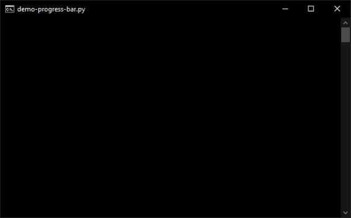

# Progress Bars
Show progress bars in the terminal with the `ProgressBar` class. Create an instance with any desired arguments, then use the `Update()` function to update the progress bar in a loop where your progress happens. If less time has passed than the number of milliseconds in `updateInterval`, the progress bar will not update.

## Create Instance
### Parameters
Parameter|Default Value|Type|Description
----------------|------|-----|---------------------------------------------------------------
`iteration`     |`0`   |`int`|Iteration of the progress bar (how full it is)
`total`         |`50`  |`int`|Total number of iterations in the progress bar
`prefix`        |`''`  |`str`|Prefix before the progress bar
`suffix`        |`''`  |`str`|Suffix after the progress bar
`length`        |`50`  |`int`|Number of characters in the progress bar
`fill`          |`'█'` |`str`|Character to fill the progress bar with
`emptyFill`     |`'-'` |`str`|Character to fill the empty part of the progress bar with
`decimals`      |`1`   |`int`|Number of decimals to show in the percent
`end`           |`'\r'`|`str`|Character(s) to print at the end
`updateInterval`|`100` |`int`|Interval after which to update the progress bar in milliseconds

## Update
### Parameters
Parameter|Default Value|Type|Description
-----------|-------|------|-------------------------------------------------------------------
`iteration`|`None` |`int` |Iteration of the progress bar (how full it is)
`force`    |`False`|`bool`|Force the progress bar to be updated regardless of `updateInterval`

All arguments specified when [creating an instance](#create-instance) can also be changed in the `Update()` function.

### Alternate Names
- `update()`

## Example
<details>
<summary>Click to expand</summary>

```python
from pyco import *
import time

bar = ProgressBar(prefix="Example progress bar")
for i in range(101):
    bar.Update(i)
    time.sleep(0.1)
```

</details>
