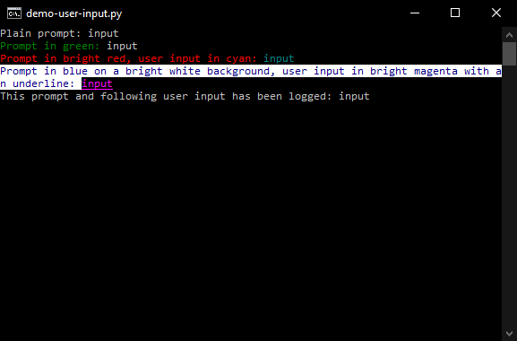

# Terminal Printing and Input
## Printing Messages
Print messages in the terminal with customizable colors and prefixes using `print_message()`. Use this function instead of Python's built-in `print()`.
Prefixes are automatically enclosed in square brackets.
Certain prefixes are automatically highlighted according to constants in the `Color` class.
You may override preset colors.

### Prefixes
|Prefix|Constant|Default Color|
---------|---------------|--------------------------------
`ERROR`  |`Color.ERROR`  |`Color.Foreground.BRIGHT_RED`
`WARNING`|`Color.WARNING`|`Color.Foreground.BRIGHT_YELLOW`
`SUCCESS`|`Color.SUCCESS`|`Color.Foreground.BRIGHT_GREEN`
`INFO`   |`Color.INFO`   |`Color.Foreground.WHITE`

### Parameters
|Parameter|Default Value|Type|Description|
---------------|------------|-------|--------------------------------------------
`message`      |`''`        |`str`  |The message you want to print in the console
`prefix`       |`None`      |`str`  |The prefix before the message
`messageColor` |`Color.AUTO`|`Color`|The color of the message. If `AUTO`, it will use `Color.DEFAULT_MESSAGE_COLOR`
`prefixColor`  |`Color.AUTO`|`Color`|The color of the prefix. If `AUTO`, it will color according to the prefix.
`colorBrackets`|`False`     |`bool` |Specify whether to color the brackets surrounding the prefix or not
`log`          |`None`      |`bool` |Log the message in the log file. If `None`, it will log according to `Logger.enableMessageLogging` and `Logger.logLevel`
`sep`          |`' '`       |`str`  |Separator, directly passed to `print()`
`end`          |`\n`        |`str`  |String to print at the end, directly passed to `print()`
`flush`        |`False`     |`bool` |Flush the output buffer to show changes immediately, directly passed to `print()`

### Alternate Names
- `Print`
- `PrintMsg`
- `print_msg`
- `print_message`

### Example
<details>
<summary>Click to expand</summary>

```python
from pyco import *

print_message("This is a normal message")
print_message("This is an error message", prefix="ERROR")
print_message("This is a warning message", prefix="WARNING")
print_message("This is a success message", prefix="SUCCESS")
print_message("This is an info message", prefix="INFO")
print_message("Automatic prefix highlighting is case insensitive", "Success")
print_message("This is a message with a custom prefix", prefix="Custom Prefix")
print_message("This is a message with a custom color", messageColor=Color.Fore.BRIGHT_CYAN)
print_message("You can combine custom prefixes and colors", prefix="Example", prefixColor=Color.Fore.BRIGHT_MAGENTA)
print_message("You can even override preset message colors", prefix="ERROR", prefixColor=Color.Fore.BRIGHT_GREEN)
print_message("You can set the colors for the message and prefix separately", prefix="Example", messageColor=Color.Fore.RED, prefixColor=Color.Fore.YELLOW)
print_message("For even more customizability, you can choose whether to color only the prefix,", prefix="INFO", prefixColor=Color.Fore.BRIGHT_BLUE)
print_message("Or the brackets as well", prefix="INFO", prefixColor=Color.Fore.BRIGHT_BLUE, colorBrackets=True)
print_message("This message has been logged in the log file", prefix="INFO", log=True)
```

</details>

## User Input
Get user input from the terminal with colors using `user_input()`. Use this function instead of Python's built-in `input()`.

### Parameters
|Parameter|Default Value|Type|Description|
-------------|----------------------------|-------|----------------------------------
`prefix`     |`''`                        |`str`  |The prompt before the user's input
`prefixColor`|`Color.DEFAULT_PREFIX_COLOR`|`Color`|The color of the prefix
`inputColor` |`Color.DEFAULT_INPUT_COLOR` |`Color`|The color of the user's input
`log`        |`None`                      |`bool` |Log the prompt and input in the log file. If `None`, it will log according to `Logger.enableInputLogging`

### Alternate Names
- `Input`
- `userinput`
- `user_input`

### Example
<details>
<summary>Click to expand</summary>

```python
from pyco import *

user_input("Plain prompt: ")
user_input("Prompt in green: ", Fore.GREEN)
user_input("Prompt in bright red, user input in cyan: ", Fore.BRIGHT_RED, Fore.CYAN)
user_input("Prompt in blue on a bright white background, user input in bright magenta with an underline: ", Fore.BLUE + Back.BRIGHT_WHITE, Fore.BRIGHT_MAGENTA + Style.UNDERLINE)
user_input("This prompt and following user input has been logged: ", log=True)
```

</details>
